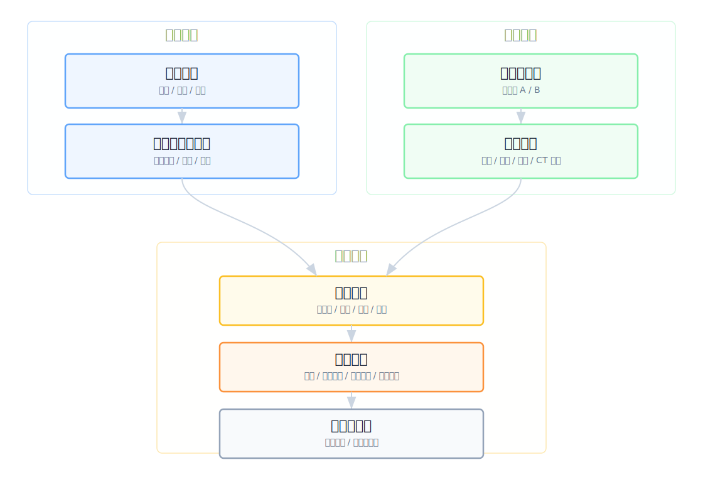
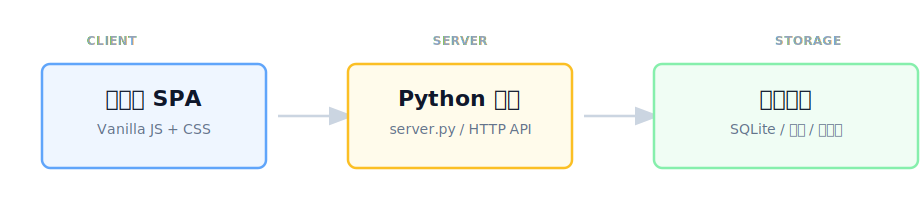

# TestChamber V7

<p align="center">
  <a href="https://github.com/LiZiqian/TestChamber/releases/tag/v7.1.0"></a>
  
  
  
  
  
</p>

面向硬件测试实验室的样机、任务、结果与数据包治理平台。

TestChamber V7 把“项目 -> 阶段 -> 测试任务 -> 样机 -> 结果 -> 履历”这条链路收进一个可以在 Windows 内网机器上直接运行的轻量系统。它不依赖外部云服务，不需要安装数据库服务器，也不需要 npm / pip 依赖；下载源码、启动 Python 服务、打开浏览器即可开始使用。

> [!NOTE]
> - 当前版本：`7.1.0`
> - 默认端口：`9398`（可自定义）
> - 默认数据目录：`data/`
> - 推荐运行环境：Windows + Python 3.9+ + Chrome / Edge

## 目录

- [为什么需要 TestChamber](#为什么需要-testchamber)
- [核心能力](#核心能力)
- [适合谁使用](#适合谁使用)
- [快速部署](#快速部署)
- [Windows 详细部署教程](#windows-详细部署教程)
- [启动方式对比](#启动方式对比)
- [端口选择建议](#端口选择建议)
- [Python 找不到怎么办](#python-找不到怎么办)
- [第一次使用路线](#第一次使用路线)
- [数据、备份与迁移](#数据备份与迁移)
- [常见问题](#常见问题)
- [开发者信息](#开发者信息)
- [发布与仓库卫生](#发布与仓库卫生)

## 为什么需要 TestChamber

硬件测试项目里，最容易失控的不是单个测试动作，而是跨项目、跨阶段、跨人员、跨样机的状态同步：

- 哪些样机已经被任务占用，哪些还能下发？
- 某台样机经历过哪些项目、阶段、测试项和故障？
- 一个阶段里有多少任务待下发、进行中、阻塞、已完成？
- 结果照片、DTS、问题描述和样机去向是否能和任务绑定？
- 换电脑、换平台或交付测试数据时，能不能把数据和照片完整迁移？

TestChamber V7 的目标是把这些分散在 Excel、聊天记录、文件夹和个人记忆里的信息，变成可追踪、可查询、可迁移的测试运行台账。

## 核心能力

| 模块 | 能做什么 | 价值 |
|------|----------|------|
| 项目管理 | 管理项目、阶段、SKU、BOM、测试策略、人员和地点 | 把测试计划拆成可执行的阶段和任务 |
| 任务管理 | 创建、配置、启动、阻塞、临时变更、结束任务 | 让任务状态、执行人、计划时间和样机占用可追踪 |
| 样机档案池 | 维护样机池、样机基础信息、状态、保管人、借用人 | 避免样机重复建档、重复占用和去向不清 |
| 结果录入 | 逐台样机填写结论、问题、DTS、去向和照片 | 让测试结论和样机履历绑定 |
| 照片与履历 | 上传照片、生成缩略图、查看样机事件和测试历史 | 保留故障证据和生命周期记录 |
| 数据包导入导出 | 导出完整 zip，导入前预览冲突，提交后重建引用 | 支持跨电脑迁移、交付、备份和空白平台整包导入 |
| 安全兜底 | 样机占用冲突检测、结束任务防重复、导入一致性校验 | 降低误操作和数据错乱风险 |
| 大数据性能 | 启动骨架、服务端分页、SQLite 索引、增量写入 | 面对大量任务、样机和照片元数据时仍能保持流畅 |

## 适合谁使用

TestChamber V7 特别适合这些场景：

- 实验室或测试团队需要在内网机器上共享一个测试平台。
- 项目有多个阶段、多个测试项，样机需要在任务之间流转。
- 团队现在用 Excel 记录样机、任务和结果，但经常出现状态不同步。
- 测试结果需要保留照片、DTS、故障描述和样机去向。
- 平台需要简单部署，不希望引入复杂后端、云服务或专门数据库运维。
- 数据需要能打包导出，方便备份、迁移或交付。

## 系统一眼看懂

<p align="center">
  
</p>

技术结构：

<p align="center">
  
</p>

## 快速部署

### 1. 准备 Python

安装 Python 3.9 或更高版本。Windows 推荐任选一种：

- Python 官网安装包
- Miniforge
- Mambaforge
- Anaconda

安装后可以在终端里验证：

```powershell
python --version
```

### 2. 下载并解压项目

从 GitHub 下载源码压缩包，解压到一个稳定目录，例如：

```text
C:\TestChamberV7
```

不要放在会频繁同步、自动清理或权限受限的目录里。

### 3. 双击启动

在项目目录里双击：

```text
start_server.bat
```

启动脚本会做三件事：

1. 询问是否使用默认端口 `9398`。
2. 自动寻找 Python，包括 `PYTHON_EXE`、`CONDA_PREFIX`、Miniforge、Mambaforge、Anaconda、`py -3` 和 `python`。
3. 找不到 Python 时，提示你输入或拖入 `python.exe` 路径。

### 4. 打开浏览器

启动成功后，在本机浏览器访问：

```text
http://127.0.0.1:9398/
```

如果你在 `.bat` 里选择了其他端口，把 `9398` 换成你输入的端口。

### 5. 内网访问

如果要让同一局域网的其他电脑访问，服务器电脑需要保持启动窗口不关闭，然后其他电脑访问：

```text
http://服务器IP:9398/
```

例如：

```text
http://192.168.1.20:9398/
```

> [!TIP]
> 有线网络能访问但无线网络不能访问时，通常不是 TestChamber 程序问题，而是无线网络隔离、访客 Wi-Fi、VLAN、ACL 或防火墙策略导致。优先检查网络路径和端口连通性。

## Windows 详细部署教程

### 步骤 1：确认电脑有 Python

打开 PowerShell，执行：

```powershell
python --version
```

能看到版本号即可，例如：

```text
Python 3.10.11
```

如果提示找不到 Python，也可以继续双击 `start_server.bat`。启动脚本会尝试自动寻找常见安装目录；实在找不到时，会让你手动输入 `python.exe` 路径。

### 步骤 2：进入项目目录

项目目录里至少应看到这些文件：

```text
server.py
index.html
start_server.bat
start_server.ps1
README.md
css/
js/
templates/
```

### 步骤 3：启动服务

推荐普通用户使用：

```text
start_server.bat
```

推荐开发或调试时使用：

```powershell
python .\server.py --host 127.0.0.1 --port 9398
```

如果需要允许局域网访问：

```powershell
python .\server.py --host 0.0.0.0 --port 9398
```

### 步骤 4：验证服务

本机访问：

```text
http://127.0.0.1:9398/
```

健康检查：

```text
http://127.0.0.1:9398/api/health
```

如果返回 JSON，说明后端已经正常运行。

### 步骤 5：停止服务

关闭启动窗口，或在终端按：

```text
Ctrl + C
```

## 启动方式对比

| 启动方式 | 适合人群 | 端口 | Python 查找 | 说明 |
|----------|----------|------|-------------|------|
| `start_server.bat` | 普通 Windows 用户 | 可选择默认 `9398` 或自定义 | 自动查找，找不到会循环询问路径 | 最推荐的双击启动方式 |
| `start_server.ps1` | PowerShell 用户 | 默认 `9398` | 自动查找，找不到会循环询问路径 | 适合 PowerShell 环境 |
| `python server.py --host 127.0.0.1 --port 9398` | 开发调试 | 手动指定 | 使用当前终端 Python | 本机访问最清晰 |
| `python server.py --host 0.0.0.0 --port 9398` | 内网部署 | 手动指定 | 使用当前终端 Python | 允许局域网其他电脑访问 |

## 端口选择建议

默认端口是：

```text
9398
```

如果端口被占用，`start_server.bat` 可以选择自定义端口。建议使用：

```text
1024 - 49151
```

尽量避开这些常见端口：

| 端口 | 常见用途 |
|------|----------|
| `3000` | 前端开发服务器 |
| `3306` | MySQL |
| `5000` | Flask / 开发服务 |
| `5432` | PostgreSQL |
| `6379` | Redis |
| `8000` | 开发服务器 |
| `8080` | 代理 / Web 服务 |
| `8888` | Notebook / 工具服务 |
| `9000` | 对象存储 / 工具服务 |

如果只是 TestChamber 自己使用，优先保留 `9398`。

## Python 找不到怎么办

有些电脑上，即使打开 Miniforge Terminal 再把 `.bat` 拖进去，也可能提示找不到 Python。常见原因包括：

- 当前终端的环境变量没有传给 `.bat`。
- Miniforge / Anaconda 没装在默认目录。
- `python.exe` 存在，但没有加入 `PATH`。
- 用户把 `.bat` 从压缩包内直接运行，当前目录不完整。
- 安装的是 Microsoft Store 的 Python 占位启动器。
- 公司电脑策略限制了脚本读取某些路径。

`start_server.bat` 和 `start_server.ps1` 已经做了兜底：

1. 先打印 `PYTHON_EXE`、`CONDA_PREFIX`、`where python`、`where py`。
2. 自动检查常见 Conda / Miniforge / Anaconda 路径。
3. 尝试 `py -3` 和 `python`。
4. 仍然找不到时，让用户输入或拖入 `python.exe`。
5. 如果输入的是目录，会自动尝试 `<目录>\python.exe`。
6. 每次输入都会验证是否真的能执行 Python。

你可以手动输入类似路径：

```text
C:\Users\你的用户名\miniforge3\python.exe
C:\Users\你的用户名\Anaconda3\python.exe
C:\ProgramData\Anaconda3\python.exe
D:\Miniforge3\python.exe
```

输入 `Q` 可以退出启动脚本。

## 第一次使用路线

建议按这个顺序建立你的第一套测试数据：

1. 进入 **样机档案池**，创建一个样机池。
2. 新增样机，或用模板批量导入样机。
3. 进入 **项目管理**，创建一个测试项目。
4. 进入项目，创建阶段、SKU、项目人员和测试地点。
5. 在阶段里配置测试策略和用例集。
6. 进入任务管理，从测试策略生成任务。
7. 打开任务配置，选择执行人、计划时间和样机。
8. 启动任务，执行测试。
9. 在结果页面逐台录入测试结论、问题、照片和去向。
10. 结束任务，查看样机履历和项目进度。
11. 需要迁移或备份时，导出完整数据包。

## 主要工作流

### 项目与阶段

- 新建项目，维护项目编号、负责人和备注。
- 在项目内新建阶段，按阶段管理 SKU、BOM 和测试策略。
- 维护项目成员和测试地点，供任务配置和结果记录使用。

### 任务下发与执行

- 从阶段策略生成任务。
- 配置执行人、计划时间和样机。
- 启动任务后，样机进入任务占用链路。
- 任务可进入 `进行中`、`阻塞中`、`正常完成` 或 `异常终止`。

任务状态：

```text
待下发 -> 进行中 <-> 阻塞中 -> 正常完成 / 异常终止
```

### 样机档案与履历

- 样机按样机池分类管理。
- 支持 IMEI、SN、主板 SN 等标识。
- 支持状态、保管人、借用人、位置、照片、问题和事件日志。
- 样机参与任务后，会形成跨项目、跨阶段的测试履历。

样机状态：

```text
闲置 <-> 在位等待 <-> 测试中
  |          |            |
已退库    取走分析      故障
```

### 结果录入

- 对任务里的每台样机填写测试结论。
- 记录 DTS、故障描述、问题照片和最终去向。
- 支持草稿，避免结果未录完就丢失。
- 结束任务时有前端防重复和后端幂等兜底。

### 数据包导入导出

完整数据包包含：

- 平台状态数据
- manifest
- checksum
- 样机照片资产
- 缩略图资产

导入前会先预览，检查结构、冲突和引用一致性。空白平台可以直接整包导入。

## 数据、备份与迁移

### 本地数据目录

首次运行会自动创建：

```text
data/
├── testchamber.sqlite
└── samples/
    └── <sampleId>/
        └── photos/
```

其中：

| 路径 | 说明 |
|------|------|
| `data/testchamber.sqlite` | SQLite 主数据库 |
| `data/samples/.../photos/` | 样机照片和缩略图 |
| `backups/` | 自动备份目录 |

### 不要上传运行数据

仓库的 `.gitignore` 已忽略：

```text
data/
backups/
__pycache__/
*.sqlite
*.db
```

不要把真实数据库、备份、照片或公司测试数据提交到 GitHub。

### 推荐备份方式

日常备份优先使用平台内的：

```text
导出完整数据包
```

这样可以同时带走数据库状态、样机照片和引用关系。直接复制 `data/` 也可以作为本机级备份，但跨电脑迁移时更推荐数据包导出导入。

## 常见问题

### 双击 `.bat` 时 Windows 提示“无法验证发布者”

这是 Windows 对从网络下载的脚本文件做的安全提醒，不代表 TestChamber 本身有问题。源码项目通常没有商业代码签名证书，所以会出现这个提示。

常见处理方式：

- 确认文件来源是你信任的 GitHub 仓库。
- 解压后右键文件，检查属性里是否有“解除锁定”。
- 点击“仍要运行”继续启动。

如果后续要给大量非技术用户分发，可以考虑制作签名的 MSI 或 EXE 安装包；当前源码部署方式更轻量，维护成本更低。

### 浏览器打不开 `http://127.0.0.1:9398/`

依次检查：

1. 启动窗口是否还开着。
2. 端口是否被其他程序占用。
3. 启动日志里是否有 Python 报错。
4. 是否选择了非 `9398` 的自定义端口。
5. 访问 `/api/health` 是否返回 JSON。

### 局域网其他电脑打不开

本机能打开，但其他电脑打不开时，优先检查：

- 启动参数是否是 `--host 0.0.0.0`。
- Windows 防火墙是否允许该端口入站。
- 服务器 IP 是否正确。
- 访问电脑和服务器是否在同一网段。
- 公司 Wi-Fi 是否开启客户端隔离或访客网络隔离。
- VLAN / ACL 是否阻止访问服务器端口。

快速测试：

```powershell
Test-NetConnection 服务器IP -Port 9398
```

### 端口已经被占用

可以：

- 关闭占用该端口的旧 TestChamber 窗口。
- 在 `start_server.bat` 中选择自定义端口。
- 手动启动时改端口：

```powershell
python .\server.py --host 0.0.0.0 --port 9400
```

然后访问：

```text
http://127.0.0.1:9400/
```

### 导入数据包前要注意什么

建议先确认：

- 当前没有未保存的操作。
- 数据包来源可信。
- 预览页没有 blocker。
- 冲突项的保留、覆盖或合并选择符合预期。

空白平台整包导入已经有一致性校验，导入后会检查项目、阶段、任务和样机引用关系。

## 开发者信息

### 环境要求

| 项目 | 要求 |
|------|------|
| Python | 3.9+ |
| 浏览器 | Chrome / Edge / Firefox / Safari |
| 后端依赖 | Python 标准库 |
| 前端依赖 | 无构建依赖 |
| 数据库 | SQLite WAL |

无需执行：

```text
pip install
npm install
```

### 项目结构

```text
TestChamberV7/
├── server.py                 # Python stdlib HTTP server + SQLite persistence
├── index.html                # SPA entry
├── start_server.bat          # Windows double-click launcher
├── start_server.ps1          # PowerShell launcher
├── README.md
├── css/                      # Split stylesheets
├── js/
│   ├── app.core.js           # App bootstrap
│   ├── app.server.js         # API calls and incremental mutations
│   ├── app.data.js           # Data normalization and state helpers
│   ├── app.render.js         # Main render dispatcher
│   ├── projects.js
│   ├── samples/
│   └── workspace/
├── templates/                # CSV / XLSX import templates
├── tests/                    # Python and frontend regression tests
├── tools/                    # Benchmark tooling
├── data/                     # Runtime data, ignored by Git
└── backups/                  # Runtime backups, ignored by Git
```

### 核心数据流

启动时：

```text
GET /api/bootstrap
  -> 项目摘要 + 样机池摘要 + revision
  -> 前端初始化导航和首页
```

大列表：

```text
GET /api/stages/<stageId>/tasks?page=...
GET /api/sample-categories/<catId>/samples?page=...
  -> 服务端分页
  -> 前端缓存当前页并预取相邻页
```

日常写入：

```text
PATCH /api/tasks/<taskId>/mutation
PATCH /api/projects/<projectId>/mutation
PATCH /api/stages/<stageId>/mutation
PATCH /api/samples/<sampleId>/mutation
PATCH /api/sample-categories/<categoryId>/mutation
  -> 只提交受影响记录
  -> SQLite 更新 revision
```

完整状态：

```text
GET /api/state
PUT /api/state
```

完整状态接口仍保留为导出、调试和异常兜底路径，不作为日常启动和大列表浏览主路径。

### API 摘要

| Method | Path | 说明 |
|--------|------|------|
| `GET` | `/` | SPA 入口 |
| `GET` | `/api/health` | 健康检查 |
| `GET` | `/api/bootstrap` | 启动骨架 |
| `GET` | `/api/projects/summary` | 项目摘要 |
| `GET` | `/api/projects/<id>` | 项目详情 |
| `GET` | `/api/stages/<stageId>/tasks` | 阶段任务分页 |
| `GET` | `/api/sample-categories` | 样机池摘要 |
| `GET` | `/api/sample-categories/<id>` | 样机池详情 |
| `GET` | `/api/sample-categories/<id>/samples` | 样机分页 |
| `PATCH` | `/api/tasks/<id>/mutation` | 任务增量写入 |
| `PATCH` | `/api/stages/<id>/tasks/batch` | 批量任务增量写入 |
| `PATCH` | `/api/projects/<id>/mutation` | 项目增量写入 |
| `PATCH` | `/api/stages/<id>/mutation` | 阶段增量写入 |
| `PATCH` | `/api/samples/<id>/mutation` | 单台样机增量写入 |
| `PATCH` | `/api/sample-categories/<id>/mutation` | 样机池增量写入 |
| `POST` | `/api/samples/<id>/photos` | 上传样机照片 |
| `DELETE` | `/api/samples/<id>/photos/<photoId>` | 删除样机照片 |
| `GET` | `/api/samples/<id>/photos` | 按需读取样机照片 |
| `GET` | `/api/samples/<id>/events` | 按需读取样机事件 |
| `GET` | `/api/export-bundle` | 导出完整数据包 |
| `POST` | `/api/import-bundle/preview` | 数据包导入预览 |
| `POST` | `/api/import-bundle/commit` | 数据包导入提交 |
| `GET` | `/api/state` | 完整状态读取，低频兜底 |
| `PUT` | `/api/state` | 完整状态保存，低频兜底 |

### 验证命令

发布或改动核心代码前建议运行：

```powershell
python -m py_compile server.py
python tests\test_server_core.py
python tests\test_import_conflicts.py
node tests\frontend_pagination_perf.test.cjs
node tests\frontend_status_transitions.test.cjs
```

启动验证：

```powershell
python .\server.py --host 127.0.0.1 --port 9398
```

另开一个 PowerShell：

```powershell
Invoke-WebRequest -Uri http://127.0.0.1:9398/api/health -UseBasicParsing
```

## 已完成的关键优化

- 启动入口改为 `/api/bootstrap`，避免首屏直接拉完整状态。
- 任务表和样机池走服务端分页。
- SQLite 查询列和索引用于任务状态、样机状态、分页和统计。
- 项目、阶段、任务、样机、样机池主路径改为 PATCH 增量写入。
- 样机照片和事件按需加载。
- 样机选择器限制只有“闲置”样机可新增选择。
- 结束任务有前端 in-flight 防重和后端 `TASK_ALREADY_FINISHED` 幂等兜底。
- 完整数据包导入支持空白平台整包导入、冲突预览和提交前一致性校验。
- Windows 启动脚本增强 Python 自动发现、路径输入兜底和 `.bat` 端口选择。

## 后续方向

- 进一步减少导入成功后的全局刷新，改为局部同步受影响对象。
- 补充照片上传/删除、结果录入、任务临时变更、SQLite 迁移专项测试。
- 继续降低前端字符串拼接和内联事件带来的维护成本。
- 在任务详情、样机详情、照片区继续做大数据量渲染压测。

## 发布与仓库卫生

### 发布前检查

1. 更新 `server.py` 的 `APP_VERSION` / `SERVER_VERSION`。
2. 更新 `js/app.core.js` 的 `app.version`。
3. 同步静态资源 cachebuster。
4. 跑完核心测试。
5. 确认没有提交运行数据。

### 不应提交到仓库

- `data/`
- `backups/`
- `__pycache__/`
- `*.sqlite`
- `*.db`
- 本地 AI 指令文件，例如 `AGENTS.md`、`CLAUDE.md`

本地私有忽略规则可以写入：

```text
.git/info/exclude
```

这样不会污染仓库里的 `.gitignore`。

### Release 提醒

如果某个 tag 或 release 已经创建，旧 release 源码包会保留当时的文件快照。即使后续从 `main` 删除了某个文件，旧 release 包也不会自动变化。需要让旧版本源码包也变干净时，应重新打 tag 或重新发布 release。
