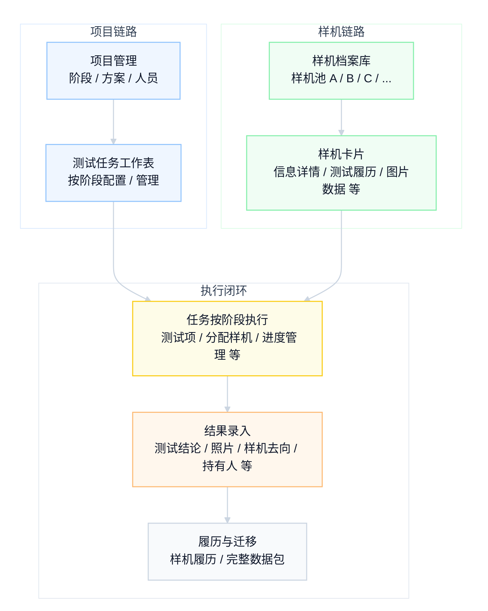

# TestChamber

<p align="center">
  <a href="https://github.com/LiZiqian/TestChamber/releases/latest"></a>
  
  
  
  
  
</p>

TestChamber 是给硬件测试实验室使用的本地内网 Web 台账，用来管理项目、阶段、测试任务、样机池、测试结果、照片、问题记录和数据迁移。

它的部署方式很轻：不需要云服务，不需要单独安装数据库，不需要 `pip install` 或 `npm install`。下载源码后，用 Python 启动服务，在浏览器打开即可使用。

> [!NOTE]
> - 当前版本由系统内置版本模块统一维护
> - 默认端口：`9398`
> - 默认数据目录：项目内 `data/`
> - 推荐环境：Windows + Python 3.9+ + Chrome / Edge

## 使用场景

- 实验室或测试团队需要在内网共享一套测试台账。
- 样机需要在多个项目、阶段和任务之间流转。
- 测试结果需要绑定 DTS、问题描述、照片和样机去向。
- 团队希望从 Excel、聊天记录和散落文件夹迁移到统一记录。
- 数据需要能完整导出，方便留存、迁移或交付。

## 主要功能

| 功能 | 说明 |
|------|------|
| 项目管理 | 管理项目、阶段、SKU、BOM、测试策略、人员和地点 |
| 任务管理 | 创建任务，配置执行人、计划时间和样机，支持启动、阻塞、临时变更和结束 |
| 样机档案池 | 维护样机池、样机身份、状态、保管人、借用人、位置和照片 |
| 结果录入 | 逐台样机记录结论、问题、DTS、照片和最终去向 |
| 履历追踪 | 查看样机跨项目、跨阶段、跨任务的测试历史 |
| 数据包 | 导出完整数据包，导入前预览冲突，也支持单台样机档案包 |
| 安全检查 | 样机占用冲突、身份查重、重复结束任务和导入一致性校验 |

核心工作流：



## 快速启动

### 1. 准备 Python

安装 Python 3.9 或更高版本。Windows 可以使用 Python 官网安装包、Miniforge、Mambaforge 或 Anaconda。

验证命令：

```powershell
python --version
```

如果命令找不到 Python，也可以继续运行 `start_server.bat`；启动脚本会尝试自动查找 Python，并在找不到时让你输入 `python.exe` 路径。

### 2. 下载项目

从 GitHub 下载源码压缩包，解压到一个稳定目录，例如：

```text
C:\TestChamber
```

如果使用 Git 管理源码，可以直接 clone 到本地：

```powershell
git clone https://github.com/LiZiqian/TestChamber.git
cd TestChamber
```

以后别人更新了 GitHub 代码，本地进入项目目录后执行：

```powershell
git pull
```

正常使用不需要 `pip install` 或 `npm install`。拉取更新后重新运行 `start_server.bat` 即可；业务数据默认保存在项目内 `data/`，不要从 GitHub 覆盖或提交真实数据库、照片和公司测试数据。如果浏览器还显示旧界面，先关闭旧启动窗口，重新启动服务，再刷新浏览器页面。

### 3. 双击启动

进入项目目录，双击：

```text
start_server.bat
```

启动脚本会询问是否使用默认端口 `9398`。直接回车或输入 `Y` 使用默认端口；输入 `N` 可以换端口。

### 4. 打开浏览器

本机访问：

```text
http://127.0.0.1:9398/
```

如果使用了自定义端口，把 `9398` 换成实际端口。

### 5. 局域网访问

`start_server.bat` 默认允许同一局域网访问。服务器电脑保持启动窗口不关闭，其他电脑访问：

```text
http://服务器IP:9398/
```

例如：

```text
http://192.168.1.20:9398/
```

### 6. 停止服务

关闭启动窗口，或在启动窗口按：

```text
Ctrl + C
```

## 其他启动方式

开发或调试时，可以直接在项目目录运行：

```powershell
python -m backend.server --host 127.0.0.1 --port 9398
```

允许局域网其他电脑访问：

```powershell
python -m backend.server --host 0.0.0.0 --port 9398
```

健康检查：

```text
http://127.0.0.1:9398/api/health
```

## 第一次使用顺序

1. 进入样机档案池，创建样机池。
2. 新增样机，或使用模板批量导入样机。
3. 进入项目管理，创建项目和阶段。
4. 配置 SKU、BOM、测试策略、项目人员和测试地点。
5. 从测试策略生成任务。
6. 配置任务执行人、计划时间和样机。
7. 启动任务，执行测试。
8. 在结果页面录入结论、DTS、问题、照片和样机去向。
9. 结束任务后查看样机履历。
10. 需要迁移或留存时，导出完整数据包或单台样机档案包。

## 数据和迁移

运行数据默认保存在项目内 `data/`：

```text
data/
├── testchamber.sqlite
├── deployment.json
├── platform-data.json
├── samples/
├── import-previews/
└── exports/
```

| 路径 | 说明 |
|------|------|
| `data/testchamber.sqlite` | 主数据库 |
| `data/samples/` | 样机照片和缩略图 |
| `data/import-previews/` | 导入预览临时文件 |
| `data/exports/` | 导出临时 zip 文件 |

推荐迁移方式：

- 整个平台迁移：在系统内导出“完整数据包”，到新平台后导入。
- 单台样机迁移：在样机详情里导出“样机档案包”，到目标样机池导入。
- 本机留存备份：也可以复制整个 `data/` 目录，但跨电脑迁移更推荐使用数据包。

不要把真实 `data/`、数据库、照片或公司测试数据提交到 GitHub。

## 常见问题

### 浏览器打不开页面

先检查：

- 启动窗口是否还开着。
- 访问端口是否和启动时选择的端口一致。
- 启动窗口里是否有 Python 报错。
- `http://127.0.0.1:9398/api/health` 是否能打开。


### Python 找不到

`start_server.bat` 会自动查找常见 Python 路径。仍然找不到时，可以手动输入或拖入 `python.exe`，例如：

```text
C:\Users\你的用户名\miniforge3\python.exe
C:\Users\你的用户名\Anaconda3\python.exe
C:\ProgramData\Anaconda3\python.exe
```

### 端口被占用

关闭旧的 TestChamber 启动窗口，或在 `start_server.bat` 中选择其他端口。建议使用 `1024` 到 `49151` 之间的端口，并尽量避开 `3000`、`5000`、`8000`、`8080`、`8888` 等常见开发端口。
